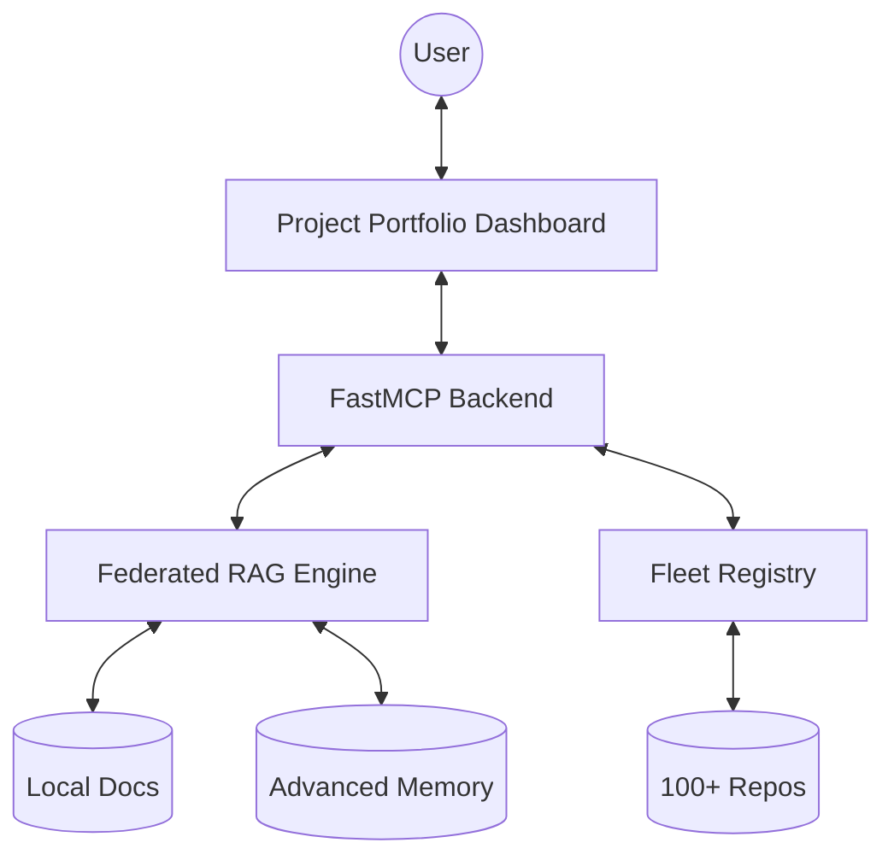

# System Architecture

Documentation MCP (Docs-MCP) is a modular hub designed for large-scale repository management and semantic discovery.

## Conceptual Overview

## Core Components

### 1. Federated RAG Engine
The RAG engine utilizes **LanceDB** to index a unified documentation space. It performs cross-repository discovery by probing for sibling paths (e.g., `../advanced-memory-mcp`). This allows agents to retrieve context from across the entire workspace without manual source selection.

### 2. Fleet Registry Service
The registry acts as the source of truth for repository metadata. It tracks:
- **Port Allocations**: Preventing collisions between webapps.
- **Project Status**: Identifying which repositories are gold-standard reference models.
- **Deep Research Links**: Connecting project metadata to the AI Assistant.

### 3. Integrated Dashboard
The React frontend (Port 10794) is the human entry point. It provides:
- **Fleet Dashboard**: Tactical control for starting/stopping MCP servers.
- **Project Portfolio**: Strategic overview of the repository shipyard.
- **AI Assistant**: Conversational interface for deep repository audits.

## Data Flow
1. **Ingestion**: On startup, the backend scans configured roots and builds/updates the vector index.
2. **Retrieval**: User queries are embedded and matched against document chunks.
3. **Synthesis**: Relevant context is passed to the LLM (via sampling) to generate a technical answer.
4. **Action**: The UI enables one-click research or navigation based on the synthesis.
