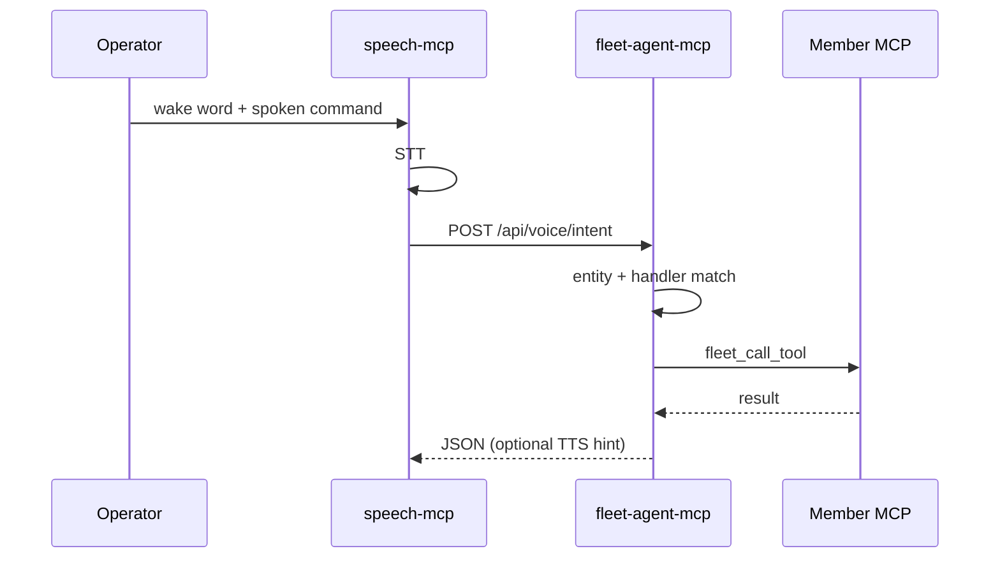

# Voice Command Bus (Fleet v1)

**Status:** Official fleet pattern (June 2026)  
**Canonical registry:** [`../config/voice_command_bus.yaml`](../config/voice_command_bus.yaml)  
**Ingress:** [speech-mcp](file:///D:/Dev/repos/speech-mcp) (wake word + utterance STT)  
**Router:** [fleet-agent-mcp](file:///D:/Dev/repos/fleet-agent-mcp) (`POST /api/voice/intent`, `route_voice_intent`)  
**Members:** alexa-mcp, yahboom-mcp, and any MCP registered in the fleet bridge

---

## 1. Purpose

Speech is **fleet infrastructure**, not a feature of a single MCP server. One always-on microphone pipeline detects a **wake word**, captures the **operator command**, transcribes it, and **delegates** to the correct fleet member.

Example:

> **wakeywakey** — *"boomy go on patrol and report what you found"*

| Step | Component | Action |
|------|-----------|--------|
| 1 | speech-mcp | openWakeWord hears `wakeywakey` |
| 2 | speech-mcp | Records ~6s utterance, STT (FunASR when enabled) |
| 3 | speech-mcp | `POST` **SpeechIntent** to fleet-agent |
| 4 | fleet-agent | Resolves entity `boomy` → server `yahboom` |
| 5 | yahboom-mcp | `yahboom_agent_mission(goal=…, speak=true)` |
| 6 | yahboom + speech | Mission status / findings → optional TTS via speech-mcp |

alexa-mcp keeps **acoustic loop** duties (TTS → Echo → mic → STT of Alexa’s reply). It does **not** own wake-word detection.

---

## 2. Architecture



### 2.1 Separation of concerns

| Layer | Owns | Must not own |
|-------|------|----------------|
| **speech-mcp** | Mic, wake word, command capture, STT, TTS playback | Robot motors, Alexa API, mission planning |
| **fleet-agent-mcp** | Entity registry, routing, `fleet_call_tool` | Exclusive mic access |
| **Member MCP** | Domain tools (`interact`, `yahboom_agent_mission`, …) | Wake word models |

---

## 3. SpeechIntent payload

`POST /api/voice/intent` body:

```json
{
  "wake": "wakeywakey",
  "transcript": "boomy go on patrol and report what you found",
  "timestamp": "2026-06-01T14:00:00+00:00",
  "source": "speech-mcp"
}
```

Response:

```json
{
  "success": true,
  "entity": "boomy",
  "server": "yahboom",
  "tool": "yahboom_agent_mission",
  "message": "Delegated to yahboom/yahboom_agent_mission",
  "data": { }
}
```

---

## 4. Entity registry

Edit [`config/voice_command_bus.yaml`](../config/voice_command_bus.yaml):

- **wake_words** — maps logical name → openWakeWord model (or custom ONNX path in speech-mcp env)
- **entities** — `boomy`, `alexa`, `fritz`, … with **aliases** and **server** bridge key
- **handlers** — per-entity keyword rules and `{remainder}` / `{transcript}` templates

Unknown entity with no keyword match: fleet-agent returns `success: false` with routing hints.

---

## 5. Operations (Windows fleet)

### 5.1 Long-running services

| Service | Port | NSSM / Headless |
|---------|------|-----------------|
| speech-mcp backend | **10909** | **Yes** — wake listener lives here |
| speech-mcp frontend | 10908 | No (dev UI only) |
| fleet-agent-mcp | **10996** | **Yes** — voice router HTTP |
| alexa-mcp backend | 10801 | On demand or always-on for dashboard |
| yahboom-mcp | 10892 | On demand; robot must be reachable when routed |

Use [`FleetStartMode.ps1`](./FleetStartMode.ps1): **`-Headless -BackendOnly`** for NSSM (see [`FLEET_EXECUTION.md`](./FLEET_EXECUTION.md)).

### 5.2 Environment

**speech-mcp**

| Variable | Default | Meaning |
|----------|---------|---------|
| `FLEET_VOICE_ROUTER_URL` | `http://127.0.0.1:10996/api/voice/intent` | Delegation target |
| `FLEET_VOICE_DELEGATE` | `1` when URL set | Enable post-wake capture + route |
| `FLEET_VOICE_COMMAND_SECONDS` | `6` | Utterance record window |
| `FLEET_VOICE_WAKE_KEYWORD` | `hey_jarvis` | openWakeWord model name until `wakeywakey` ONNX exists |

**fleet-agent-mcp**

| Variable | Default | Meaning |
|----------|---------|---------|
| `FLEET_VOICE_REGISTRY` | path to central YAML | Override registry location |

### 5.3 Mic contention

Only one process should hold the default capture device for **wake + command**. Pause speech wake while alexa-mcp runs a long `listen_for_response`, or use separate input devices. Document device IDs in member READMEs.

### 5.4 Custom wake word `wakeywakey`

Train or export an openWakeWord-compatible ONNX; register in YAML under `wake_words.wakeywakey`. Until then, dev can use `hey_jarvis` with the same pipeline.

**Do not** use openWakeWord’s stock `alexa` model as the operator wake if an Echo is in the same room.

---

## 6. Member integration checklist

- [ ] Listed in `fleet_bridge.FLEET_SERVERS` with correct `/mcp` URL ([`WEBAPP_PORTS.md`](../operations/WEBAPP_PORTS.md))
- [ ] Handler entry in `voice_command_bus.yaml`
- [ ] README pointer to this standard
- [ ] Tools idempotent where possible (voice may repeat commands)

---

## 7. Related standards

- [WEBAPP_LOGS_PAGE.md](./WEBAPP_LOGS_PAGE.md) — operator logs for routed actions (`kind: bridge`, `interaction`, `tool_call`)
- [DIALOGIC_RETURNS.md](./DIALOGIC_RETURNS.md) — multi-turn UX after delegation
- [YAHBOOM_ROBOTICS_STANDARD.md](./YAHBOOM_ROBOTICS_STANDARD.md) — Boomy missions and ROS topics

---

*Tags: #voice #speech-mcp #fleet-agent #wake-word #orchestration*
