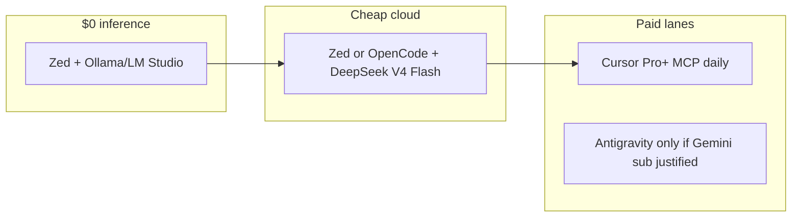

# IDE Local Inference Matrix (2026-06)

**Status:** Active  
**Updated:** 2026-06-06  

Where each primary IDE actually stands on **Ollama**, **LM Studio**, **DeepSeek**, and **$0 inference**. Stops re-litigating workarounds that never became fleet lanes.

---

## Summary

| IDE | Ollama / LM Studio | DeepSeek | $0 daily driver? | Fleet lane |
|-----|-------------------|----------|------------------|------------|
| **Zed** | **First-class** (`language_models` in settings) | **Native** `deepseek-v4-flash` / `v4-pro` (≥1.4) | **Yes** (local) + cheap cloud | **Primary** local + DS Flash |
| **Cursor** | **No** — tunnel + BYOK only; cloud-routed | BYOK only; not native | **No** | MCP + credits; [NO_LOCAL_PROVIDER](cursor/NO_LOCAL_PROVIDER.md) |
| **Antigravity 2.0** | **No** first-class; custom OpenAI-compat flaky | **Not built-in**; BYOK workaround often fails | **No** (free gutted) | **Deprioritized** unless Gemini sub already paid |
| **OpenCode** | Via config / local endpoints | **First-class** in fleet (`deepseek-v4-flash`) | Local yes; cloud cheap | Heavy jobs, Terminal Threads |

---

## Zed — use this for local + cheap cloud

- **Ollama** `localhost:11434`, **LM Studio** `localhost:1234` — documented, stable, $0.
- **DeepSeek V4 Flash** — sweet-spot paid default when local models stall on MCP tool rounds.
- **Terminal Threads** — OpenCode, Amp, Claude Code beside built-in agent.

→ [zed/CHANGELOG_DIGEST_MAY_JUN_2026.md](zed/CHANGELOG_DIGEST_MAY_JUN_2026.md)

---

## Cursor — cloud + MCP, not local

- No `localhost`; BYOK tunnels through Cursor servers.
- Jun 2026: SDK, Design Mode, auto-review — **no** Ollama/LM Studio provider added.

→ [cursor/NO_LOCAL_PROVIDER.md](cursor/NO_LOCAL_PROVIDER.md)

---

## Antigravity 2.0 — no longer a freebie

### Pricing (I/O May 2026)

Antigravity usage is **bundled into Google AI consumer plans**, not a standalone free product:

| Plan | ~Price | Notes |
|------|--------|-------|
| **Free** | $0 | **Gutted** — ~20 req/day class limits; not a real eval tier |
| **Google AI Pro** | $20/mo | Baseline Antigravity quota; weekly caps have changed repeatedly |
| **Google AI Ultra** | $100/mo | 5× Pro token pool |
| **Google AI Ultra (top)** | $200/mo | 20× Pro (down from $250) |

- **Gemini CLI** free/Pro path for individuals **ends 2026-06-18** — migrate to Antigravity CLI/harness.
- Shared quota pool for Gemini models; **non-Gemini models stay on separate fixed limits** ([Google blog](https://antigravity.google/blog/changes-to-antigravity-plans)).

**Fleet appeal (Jun 2026):** Low. Generous preview is over; quota churn burned trust. Google must ship **stable limits**, **plan mode**, and **real provider choice** to compete with Zed + Cursor for paid seats.

### Providers

| Provider | Antigravity 2.0 |
|----------|-----------------|
| **Gemini** | Default; product is Gemini-centric |
| **Claude / GPT-OSS** | Curated; separate rate limits |
| **Ollama / LM Studio** | **No** native provider; third-party “custom API” guides ≠ supported fleet path |
| **DeepSeek** | **Not built-in**; OpenAI-compat BYOK reported to **fail or fall back to Gemini** ([Google AI forum](https://discuss.ai.google.dev/t/how-to-properly-configure-custom-openai-compatible-models-in-antigravity-ide/168654)) |

**“Kinda ok” only if:** you already pay **Google AI Pro** for other reasons **and** DeepSeek BYOK actually routes in your build — verify before relying on it. For intentional DeepSeek, use **Zed** or **OpenCode**.

### Other fleet risks (unchanged)

- Documented **drive-nuking** incidents — cold backups mandatory.
- **AG SDK** — closed-source Go harness; do not put on critical path ([ANTIGRAVITY_2.0_SDK_CLI.md](antigravity/ANTIGRAVITY_2.0_SDK_CLI.md)).

→ [antigravity/README.md](antigravity/README.md)

---

## Recommended split (June 2026)

1. **Zed + Ollama/LM Studio** — default codegen and drafts.
2. **DeepSeek V4 Flash** — MCP-heavy sessions when local tool use fails.
3. **Cursor Pro+** — fleet MCP, Glass, spend watch (`cursor-mcp`); not local inference.
4. **Antigravity** — optional; not default after free-tier collapse.

---

## References

- [LOCAL_LLM_STANDARDS.md](../standards/LOCAL_LLM_STANDARDS.md)
- [FREE_AI_CODING_RESOURCES.md](FREE_AI_CODING_RESOURCES.md)
- [Cursor NO_LOCAL_PROVIDER](cursor/NO_LOCAL_PROVIDER.md)
- [Antigravity plan changes](https://antigravity.google/blog/changes-to-antigravity-plans)
