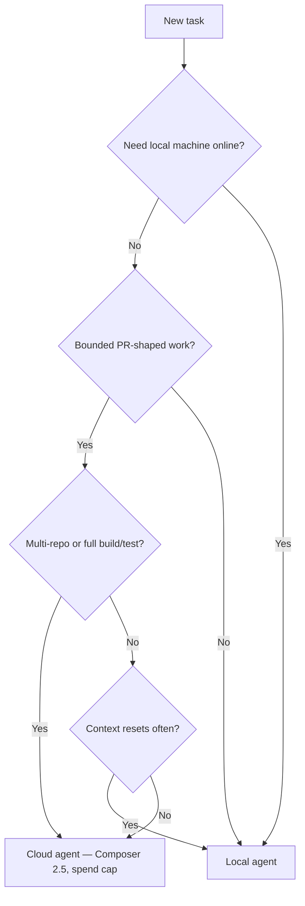

# Cursor Cloud Agents — Fleet Decision Guide

**Status:** Active  
**Updated:** 2026-06-06  
**Dashboard:** [cursor.com/dashboard/cloud-agents](https://cursor.com/dashboard/cloud-agents)  
**Docs:** [cursor.com/docs/cloud-agents](https://cursor.com/docs/cloud-agents)

Cloud Agents (formerly Background Agents) run Cursor agents in isolated cloud VMs with full dev environments instead of on the local machine. This page captures fleet stance: when to use them, when to avoid them, and how to prevent token bombs.

---

## What They Are

- Isolated VMs that clone your repo, install deps, run builds/tests, use MCPs, and push PR branches
- Triggers: web dashboard, desktop (Cloud dropdown), GitHub `@cursor`, Slack, Linear, SDK/API
- Multi-repo workspaces supported (frontend + backend + infra in one run)
- Artifacts: screenshots, videos, logs; optional remote desktop control to verify changes
- Repo hooks from `.cursor/hooks.json` run in cloud; user-level `~/.cursor/hooks.json` does not

---

## Billing (June 2026)

| Rule | Detail |
|------|--------|
| **Included usage first** | Cloud Agents draw from your plan's API pool before on-demand |
| **On-demand required** | Must enable on-demand billing to launch (even when using included pool) |
| **Spend limit required** | Set a hard limit before first run |
| **Always Max Mode** | No toggle off — larger context, faster token burn than local Auto/Composer |
| **Model = API price** | Charged at selected model's API rate |
| **Teams surcharge** | Non-Auto requests add **$0.25/M tokens** (input, output, cache) on top of model API |
| **Start headroom** | Spend limiter needs ~**$2 headroom** under hard cap or runs won't start |
| **Billing lag** | Dashboard can trail actual usage |

Forum clarification (Apr 2026): early staff answer that cloud skips included usage was **wrong** — included pool is consumed first. See [forum thread](https://forum.cursor.com/t/what-is-the-pricing-structure-for-using-cloud-agents/156843).

---

## Pros

| Benefit | Why it matters |
|---------|----------------|
| **Runs without local machine** | Long jobs, overnight work, kickoff from phone/web |
| **Parallel agents** | Many tasks at once (also a cost multiplier) |
| **Full dev environment** | Build, test, browser/desktop, verification artifacts |
| **Multi-repo** | Coordinated changes across separate repos + PRs |
| **Integrations** | `@cursor` on PRs/issues, Slack, Linear, SDK with `autoCreatePR` |
| **Team MCPs in cloud** | HTTP and stdio MCPs configured for the team |
| **PR output** | Branch + merge-ready PR; remote desktop to verify without local checkout |

---

## Cons & Token-Bomb Risks

| Risk | Detail |
|------|--------|
| **Always Max Mode** | No off switch — burns tokens faster than local Auto/Composer 2.5 |
| **Parallel × long runs** | N agents × tool rounds × MCP calls compounds quickly |
| **No in-VM context reset** | Fresh context = **new agent/VM**, not a cheap "clear chat" |
| **MCP-heavy workflows** | Large MCP fleets → many tool rounds per task |
| **Environment setup tax** | Weak `.cursor/environment.json` → retries and wasted runs |
| **Spend limit gotcha** | Hard limit at current spend blocks new runs silently |
| **Teams extra fee** | Cursor Token Rate on non-Auto cloud runs |
| **Promo/setup runs** | First few environment spins may be free — don't extrapolate from that |

### Token-bomb scenarios to avoid

1. **Ralph-style context resets via many VMs** — each reset is a new agent session
2. **Parallel cloud agents on frontier models** (Opus, Sonnet 1M) without caps
3. **Open-ended prompts** ("fix everything", "refactor the repo") with MCPs enabled
4. **Assuming cloud access = free usage** — Pro includes access; usage still consumes API pool

---

## Fleet Recommendation

**Use Cloud Agents selectively, not as default.**

| Use cloud when | Stay local when |
|----------------|-----------------|
| PR/issue automation (`@cursor fix CI`) | Tight interactive loops at keyboard |
| Multi-hour tasks while away | Small scoped edits |
| Multi-repo with real build/test verification | Token-sensitive exploration |
| Team async handoff (Slack/Linear → PR) | Workflows that reset context often |
| CI/SDK automation with bounded prompts | Local MCP + machine already configured |

### Guardrails for this fleet

1. **Default: local agents** (Auto / Composer 2.5 when possible)
2. **Cloud for bounded, async, PR-shaped work** — one repo, clear done criteria, time box
3. **Low cloud spend cap** (e.g. $20–50/mo) + usage analytics
4. **Composer 2.5 in cloud**, not Opus/Sonnet 1M, unless frontier reasoning is required
5. **Invest in `environment.json` once** — bad env = repeated failed runs
6. **Don't spin dozens of VMs for context reset** — batch per session or use local for Ralph loops

---

## Environment Setup

Agents are only as capable as their environment. Minimum:

- `.cursor/environment.json` or saved snapshot or Dockerfile
- Secrets via dashboard **Secrets** tab (not committed `.env.local` unless intentional)
- Read-write GitHub/GitLab access for target repos and submodules

Cloud dashboard shows which environment each run used. Restart agent after adding secrets.

---

## Local vs Cloud (SDK)

| Runtime | Runs on | Best for |
|---------|---------|----------|
| **Local** | Caller's machine, `cwd` | Dev loops, CI with existing checkout |
| **Cloud** | Cursor VM, cloned repo | Long jobs, fire-and-forget, auto PR (`bc-` agent IDs) |

See [Cursor SDK skill](https://cursor.com/docs/sdk/typescript) and `integrations/cursor-ide/README.md`.

---

## Decision Flow

---

## References

- [Cloud Agents docs](https://cursor.com/docs/cloud-agents)
- [Cloud agent setup](https://cursor.com/docs/cloud-agents/setup)
- [Models & pricing](https://cursor.com/docs/models-and-pricing)
- [Cloud Agents API](https://cursor.com/docs/cloud-agent/api/endpoints)
- [Pricing forum clarification](https://forum.cursor.com/t/what-is-the-pricing-structure-for-using-cloud-agents/156843)
- [CURSOR_V3_UPGRADE_APR_2026.md](../../integrations/cursor-ide/CURSOR_V3_UPGRADE_APR_2026.md)
