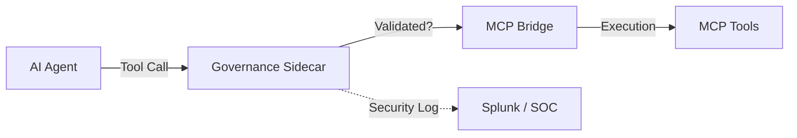

# Integration: Cisco DefenseClaw (Governance Sidecar)

> [!NOTE]
> **Status**: Released (March 2026)
> **Pattern**: Governance Sidecar / Security Proxy

## Overview

**DefenseClaw** is Cisco's enterprise-grade security framework for autonomous AI agent fleets. It provides an "operational layer" that sits between the agent runtime (e.g., **NVIDIA OpenShell**) and the resources the agent interacts with, including **Model Context Protocol (MCP)** servers.

By implementing the **Governance Sidecar** pattern, DefenseClaw enables precise interception, inspection, and enforcement of tool calls before they reach the execution environment.

---

## Core Infrastructure Components

### 1. Governance Sidecar (Security Proxy)
The Sidecar is a containerized proxy that intercepts all inbound and outbound traffic for the AI agent.
- **Interception**: Redirects tool call requests to a local validation endpoint.
- **Enforcement**: Blocks unauthorized or high-risk actions (e.g., file deletion, outbound API calls to untrusted domains).
- **Identity**: Verifies the cryptographic identity of the agent to prevent hijacking.

### 2. MCP Scanner
A specialized scanner for the **Model Context Protocol** ecosystem.
- **Endpoint Integrity**: Verifies that MCP server manifests have not changed unexpectedly.
- **Connection Whitelisting**: Ensures the agent only connects to authorized local or remote MCP servers.
- **Telemetry**: Logs every tool usage (input/output) for SOC monitoring and auditing.

### 3. Skills Scanner
Analyzes agent "skills" (extensions, plugins, scripts) for malicious patterns.
- **Capability Audit**: Compares requested permissions (filesystem, network) with the actual code implementation.
- **Signature Detection**: Identifies known backdoors or infostealers within third-party extensions.

### 4. AI Bill of Materials (AI BoM)
A structured inventory of every component in the agentic stack.
- **Inventory**: Tracks versions of the base model, runtime, skills, and MCP servers.
- **Dependency Map**: Visualizes the flow of data across the agentic network.

---

## Integration with MCP Fleets

To integrate a private MCP fleet with DefenseClaw, the following standards are recommended:

### A. Manifest Verification
All MCP servers must expose a `glama.json` or `manifest.json` that includes a cryptographic hash of the server implementation. The **MCP Scanner** will verify this hash before allowing connection.

### B. Proxy Configuration
The agent's `MCP_BRIDGE_URL` should be directed to the **Governance Sidecar** endpoint (standard port: `8081`) rather than the Bridge directly.

---

## Strategic Value

1. **Unbounded Loop Breaking**: Policy-based limiters prevent agentic runaway that can lead to massive Cloud API costs.
2. **Data Sovereignty**: The Sidecar Redacts PII and sensitive data before it is sent to external LLM frontier models.
3. **Supply Chain Defense**: The **Skills Scanner** protects the host from malicious third-party integrations (e.g. from the OpenClaw marketplace).

---

## Operational Deployment (Phase 9 Integration)

For high-security RoboFang and OpenClaw environments, the following integration patterns are recommended for Phase 9 deployment:

### 1. The "Bastion" Pattern (Cost & Loop Control)
The Sidecar acts as a **Financial Bastion**, monitoring token usage and tool call frequency.
- **Quota Enforcement**: Hard caps on Cloud API spend per agent session.
- **Loop Breaking**: Automatic termination of recursive tool calls that do not converge on a "final answer" within $N$ turns.
- **Local-First Routing**: Redirects "simple" tasks (Tier 3) to local the **VRAM Model Economy** (Ollama/LM Studio) even if the agent requests a frontier model.

### 2. The "Filter Fork" Pattern (Data Sanitization)
Ensures that sensitive system info or private keys are never leaked to external providers.
- **Redaction**: Replaces regex-matched patterns (emails, keys, private paths) with placeholders before the prompt hits the network.
- **In-Place Sanitization**: Only allows "clean" tool outputs to be sent back to the reasoning engine.

### 3. Splunk HEC Integration
DefenseClaw natively supports **Splunk HTTP Event Collector (HEC)** for real-time security alerting.
- **Audit Logging**: Every tool call is logged with `timestamp`, `agent_id`, `tool_name`, and `input_hash`.
- **Anomaly Detection**: SOC dashboards can trigger alerts if an agent suddenly starts requesting `read_file` on `/etc/shadow` or `C:\Users`.

### 4. Dockerized Sidecar Orchestration
RoboFang Phase 9 utilizes the `docker-compose.security.yml` to spin up a localized DefenseClaw instance.
- **Network Isolation**: The AI Agent container can *only* communicate with the Sidecar.
- **Resource Limits**: Memory and CPU capping for the sidecar to prevent DoS from a compromised agent.

---

> [!TIP]
> **Implementation Reference**:
> In the RoboFang ecosystem, the **Sovereign Sidecar** (Phase 9) adopts these DefenseClaw primitives. The `ReasoningEngine` is configured to route all `ask()` requests through the Sidecar's proxy address (typically `localhost:10721`).

> [!IMPORTANT]
> **Baseline Integrity**:
> DefenseClaw requires all MCP servers to be registered in the **Fleet Manifest**. Use the `heartbeat` service to maintain cryptographic sync with the Sidecar's verification engine.
