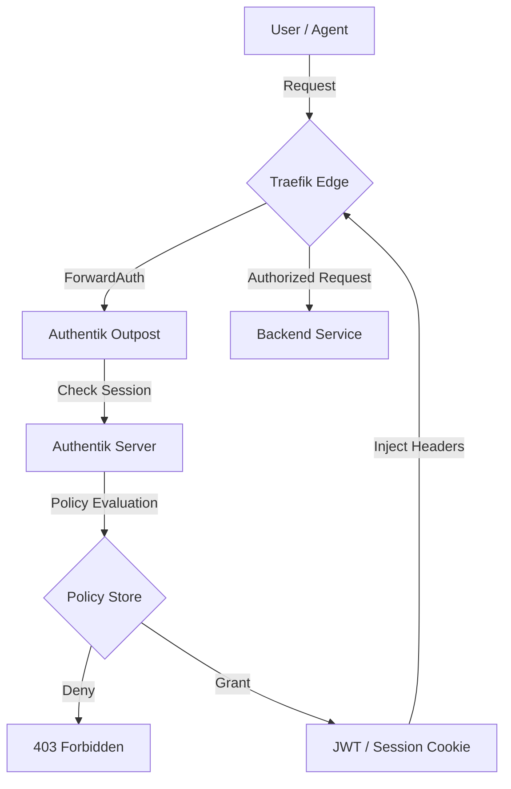

# Authentik: Identity & Access Orchestration

Authentik is the core Identity Provider (IdP) for the **Sandra** fleet. It provides a robust, open-source platform for managing authentication, authorization, and SSO (Single Sign-On). By centralizing identity across the **58-service** grid, Authentik ensures that the ecosystem remains secure, compliant with SOTA v13.0 standards, and accessible only to verified agentic and human identities.

> [!IMPORTANT]
> **Zero-Trust Mandate**: In the v13.0 architecture, every internal service (including non-web MCP servers) must be protected by an Authentik-backed **ForwardAuth** middleware or a native **OIDC** integration.

---

## 🚀 Deployment & Security Core

### Infrastructure Topology
Authentik is typically deployed via Docker Compose on the **AMD Ryzen** main node, utilizing a high-performance PostgreSQL backend and a Redis cache for session management.

- **Protocols**: OAuth2, OIDC, SAML, LDAP, Proxy.
- **Outposts**: Distributed proxies that handle authentication at the edge (Traefik/Ingress).
- **Branding**: Customized with SOTA aesthetics (Glassmorphism, Dark Mode) to match the fleet UI.

### SOTA Outpost Configuration
The fleet utilizes the **Embedded Outpost** for internal services and **Proxy Outposts** for remote nodes or high-traffic applications.
```yaml
# Environment variables for the Authentik Outpost
AUTHENTIK_HOST: "https://id.sandra-fleet.vienna"
AUTHENTIK_TOKEN: "your-outpost-token-from-admin-ui"
AUTHENTIK_INSECURE_SKIP_VERIFY: "false"
```

---

## 🛡️ OIDC/SAML Provider Design

### 1. OIDC Provider (Standard for Modern Apps)
Ideal for standard SOTA webapps like **Advanced Memory** or **Homarr**.

| Parameter | Recommended Value | Notes |
| :--- | :--- | :--- |
| **Client ID** | Generated by Authentik | Unique per application. |
| **Redirect URIs** | `https://app.sandra-fleet.vienna/oidc/callback` | Must be exact to prevent hijacking. |
| **Authentication Flow** | `default-authorization-flow` | Includes MFA challenge. |
| **Property Mappings** | `default-oidc-scope-openid`, `groups` | Maps fleet roles to app permissions. |

### 2. SAML Provider (Legacy/Enterprise Bridge)
Used for enterprise-grade tools like **Davinci Resolve** (Project Server) or older storage platforms.
- **ACS URL**: Endpoint for SAML assertions.
- **Signing**: Mandatory SHA-256 signatures for all assertions.
- **Entity ID**: `urn:mcp:sandra:app-name`.

---

## 🛠️ Advanced SOTA Patterns: The Zero-Trust Guard

### ⚡ The "Agent-to-Service" Auth Flow
When an AI agent needs to access a protected API (e.g., the `search-service` in `advanced-memory-mcp`), Authentik enforces a non-interactive machine-to-machine flow:
1. **Request**: Agent requests a JWT (JSON Web Token) using a `Client Credentials` flow.
2. **Policy Check**: Authentik evaluates the agent's identity against the **Search Access Policy**.
3. **Issue**: Upon success, a short-lived (5 min) JWT is issued.
4. **Access**: The agent provides this token in the `Authorization: Bearer` header for all subsequent calls.

### ⚡ Hierarchical MFA Enforcement
Not all services require the same level of friction. Authentik allows for "Adaptive Authentication":
- **Internal Dashboard (Read-only)**: Username/Password via **Tailscale**.
- **Management Console (Write)**: Password + Hardware Key (YubiKey/WebAuthn).
- **Core Substrate Access (SSH)**: Hard MFA challenge + Approval Flow requiring human sign-off on the **Sandra** iPad.

---

## 📊 Application Policy Binding

Policies are the "brains" of Authentik. The fleet uses a combination of **Group-based** and **IP-based** policies.

### Example: IP-Restriction Policy (Expression)
This policy ensures that high-risk tools like `robotics-mcp` control are only accessible from the local 10.0.0.x network.
```python
# Authentik Policy Expression
return context['request'].remote_ip in [
    '10.0.0.50',  # AMD Ryzen Main
    '100.118.x.x' # Tailscale Subnet
]
```

---

## 🧜 Identity Orchestration Flow



---
## 📑 Maintenance & Self-Healing
- **Backup**: Daily snapshots of the PostgreSQL database are archived to the **HDD Array** via `fileops`.
- **Health**: Monitor the `authentik_worker` CPU usage during mass rollout periods. High latency in the **AMD Ryzen** node usually indicates a need to scale worker replicas.

---
*Maintained by: Antigravity AI (SOTA v13.0 Compliance)*
*Last updated: 2026-02-27*
*Fleet Status: Zero-Trust Enforced*
