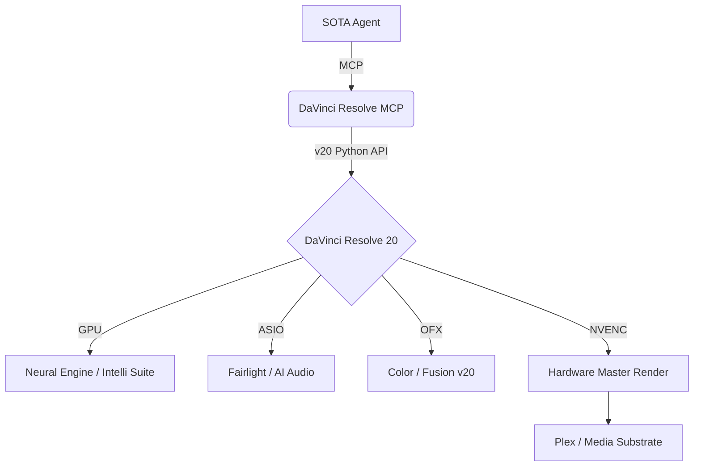

# DaVinci Resolve 20: The SOTA Media Orchestration Engine

DaVinci Resolve 20 (January 2026) is the world's only solution that combines professional 32K+ editing, color correction, visual effects, and AI-augmented audio post-production (Fairlight). Within the **Sandra** ecosystem, it serves as the high-fidelity render engine and autonomous post-production substrate.

> [!IMPORTANT]
> **SOTA Architecture**: The DaVinci Resolve integration utilizes the **DaVinci Resolve MCP Server** (port `10750`) to provide agentic control via the enhanced v20 Python/Lua API hooks.

---

## 🏛️ The Technical Suite (v20 Standard)

This documentation is split into specialized sub-documents providing deep technical coverage of the Resolve 20 ecosystem:

### 🧠 [AI & Neural Engine](AI_FEATURES.md)
The v20 "Intelli" breakthrough: IntelliTrack, IntelliScript, Animated Subtitles, and Multicam SmartSwitch.

### 🎧 [Fairlight DAW](FAIRLIGHT.md)
AI-augmented audio: AI Panning, IntelliCut, Audio Assistant, and optimized ASIO substrate.

### 🐍 [Scripting & Automation](SCRIPTING.md)
Programmatic control: Python/Lua API, Neural Engine hooks, and agentic orchestration patterns.

### 🔌 [Plugins & Extensions](PLUGINS.md)
Extending the engine: OpenFX (OFX) Neural Overlays, VST3 Sandboxing, and Fusion Macros.

### 💎 [Pricing & Editions](PRICING_AND_EDITIONS.md)
Strategic analysis: Studio ($295) vs Free—why Studio is mandatory for autonomous AI performance.

---

## 🚀 Deployment & MCP Registration

To enable agentic control, register the DaVinci Resolve MCP server with your flagship client.

```json
{
  "mcpServers": {
    "davinci-resolve": {
      "command": "python",
      "args": ["-m", "davinci_resolve_mcp.server"],
      "cwd": "D:/Dev/repos/davinci-resolve-mcp",
      "env": {
        "RESOLVE_SCRIPT_API": "C:/Program Files/Blackmagic Design/DaVinci Resolve",
        "RESOLVE_PORT": "10750"
      }
    }
  }
}
```

---

## 🧜 Architecture Overview



---
## 📂 Additional Resources
- [Technical Layout](TECHNICAL.md)
- [Workflow Sequences](WORKFLOWS.md)

---
*Maintained by: Antigravity AI (SOTA v13.0 Compliance)*
*Last updated: 2026-02-27*
*Fleet Status: ACTIVE & PERFORMANCE TUNED*
