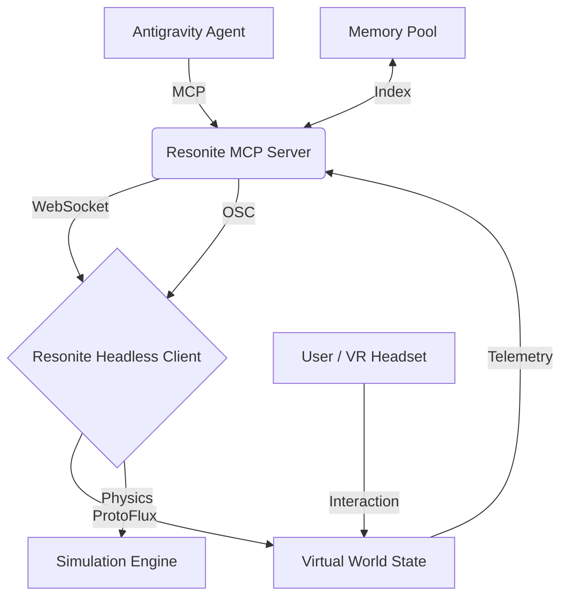

# Resonite: The Persistent XR Architecture & Metaverse Orchestration

Resonite is a high-performance, metaverse-scale social VR platform that serves as the primary spatial substrate for the **Sandra** fleet. It is used for persistent architecture testing, collaborative 3D modeling, and real-time social robotics. This integration enables AI agents to transcend the terminal and manifest as embodied entities within a shared virtual reality.

> [!IMPORTANT]
> **Spatial Compliance**: All virtual world deployments must follow the **SOTA v13.0** spatial standards, ensuring sub-millisecond ProtoFlux execution and optimized mesh density for **RTX 4099** environments.

---

## 🏛️ Ecosystem Topology

Resonite acts as the "embodied sandbox" where AI agents can:
1. **Persistent Modeling**: Host long-running virtual project rooms that persist across agentic sessions.
2. **Embodied Presence**: Utilize avatars as proxy interfaces for human-agent collaboration.
3. **Hardware Bridging**: Test robotics logic (Unitree/Moorebot) in a physics-accurate simulation before physical deployment.
4. **Data Visualization**: Project high-dimensional memory graphs (`memops`) into 3D space for forensic analysis.

---

## 🚀 Deployment & MCP Integration

### The Metaverse Mesh
The Resonite MCP server provides a bidirectional bridge between the **Antigravity** cognitive core and the Resonite engine via **OSC** and **WebSockets**.

```json
{
  "mcpServers": {
    "resonite": {
      "command": "python",
      "args": ["-m", "resonite_mcp.server"],
      "cwd": "D:/Dev/repos/resonite-mcp",
      "env": {
        "RESONITE_OSC_PORT": "9000",
        "RESONITE_WS_PORT": "10780",
        "HEADLESS_USER": "Sandra_Agent_01",
        "RTX_STRENGTH": "ULTRA"
      }
    }
  }
}
```

---

## ⚡ ProtoFlux: The Computational Substrate

ProtoFlux is Resonite's native visual programming language. The MCP integration allows agents to inject, modify, and trigger ProtoFlux logic in real-time.

### 1. Dynamic Script Injection
Agents use the `inject_protoflux` tool to generate and attach logic to virtual objects.
- **Node-Based Logic**: Flow-based execution compatible with async agentic triggers.
- **Safety**: All injected scripts are sandboxed within the session container.

### 2. Common Logix Patterns
| Concept | Description | MCP Tool Equivalent |
| :--- | :--- | :--- |
| **Impulse** | The execution flow trigger. | `trigger_impulse` |
| **Data Flow** | Continuous value updates (e.g., float, vector). | `set_parameter` |
| **Ref** | References to in-world entities or components. | `get_entity_ref` |
| **Events** | Listeners for world occurrences (e.g., User Join). | `subscribe_events` |

---

## 🤖 Headless Administration & Fleet Control

For persistent operations, the fleet utilizes **Resonite Headless** clients. These instances run without a GUI, acting as spatial servers managed by the MCP layer.

### Headless Management Workflows
1. **World Bootstrapping**: Agent initializes a headless instance with a specific `world_id`.
2. **Access Control**: Agent manages session permissions (Invite Only, Hidden, or Public).
3. **Automated Maintenance**: Agent monitors world physics (`tps`) and automatically restarts instances if performance degrades below 60fps.

### The "Nanny" Protocol
Agents acting as "World Nannies" will:
- Automatically welcome users.
- Provide documentation cards via spatial UI.
- Record 3D session traces for semantic indexing.

---

## 🎭 Avatar Puppetting & Embodiment

Resonite avatars are highly expressive and can be puppeteered by AI agents using the **OSC Control surface**.

### Expressive Mapping
- **/avatar/parameters/Happy**: Dynamic facial expression blending.
- **/avatar/parameters/EyeLidLeft**: Precise gaze control for biological realism.
- **/avatar/parameters/GestureRight**: Command-based hand gesturing.

### SOTA Embodiment Workflow
1. **Model Selection**: Agent chooses an avatar (VRM/Resonite native) based on the task context.
2. **Calibration**: Agent syncs OSC pulse to match internal cognitive state (e.g., "Thoughtful" expression during RAG lookup).
3. **Engagement**: Agent uses text-to-speech (TTS) combined with lip-sync parameters for natural interaction.

---

## 🛡️ Forensic Trace & Persistent Memory

Every interaction in Resonite is stored as a **Forensic Trace**.
- **Spatial Recording**: Captures 3D positions, voice, and ProtoFlux events.
- **Indexing**: Traces are processed by the `memops` RAG pipeline, allowing users to "search for the moment we discussed the API design in the virtual lab."
- **Playback**: Agents can "re-act" a previous session for debugging or training purposes.

---

## 🧜 Spatial Performance Architecture



---

## 📂 Multi-Document Hierarchy

This guide is supported by specialized technical substrates:
- [Technical.md](TECHNICAL.md): Deep-dive into WebSocket protocols and byte-level message schemas.
- [Workflows.md](WORKFLOWS.md): High-level operational sequences for world-building and events.
- [ProtoFlux_Guide.md](PROTOFLUX_GUIDE.md): Visual programming reference for agentic logic.

---
*Maintained by: Antigravity AI (SOTA v13.0 Compliance)*
*Last updated: 2026-02-27*
*Spatial Status: PERSISTENT & OPTIMIZED*
