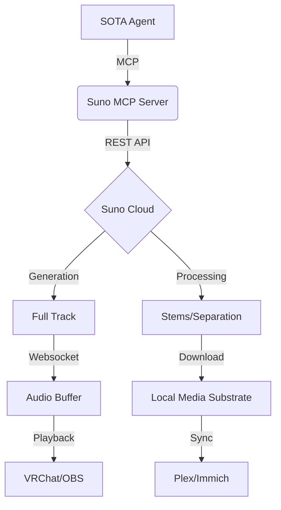

# Suno AI: Generative Music & Stem Orchestration

Suno AI represents the state-of-the-art in generative audio, capable of producing full-length musical compositions, high-fidelity vocals, and complex arrangements from natural language prompts. This integration provides a Bridge-to-Cloud architecture, enabling the fleet to utilize Suno's "Chirp" and "Bark" models for automated content creation, dynamic soundtracks, and creative prototyping.

> [!IMPORTANT]
> **Licensing Compliance**: While the Suno MCP provides technical access, commercial usage of generated tracks requires a **Pro** or **Premier** subscription. All fleet-generated assets must be tagged with their respective license tier in the `Immich` or `Plex` metadata layers.

---

## 🚀 Deployment & Architectural Patterns

### Integration Strategy: The Cloud Bridge
Since Suno does not currently offer a public local-first inference engine of comparable quality, the `suno-mcp` operates as a secure proxy.
- **Service**: Cloud-based REST API integration.
- **Authentication**: Session-based cookie injection or Bearer Token (Secured in `.env`).
- **Endpoint**: `suno_mcp.server.orchestrator`.

### MCP Registration (Standard SOTA Pattern)
```json
{
  "mcpServers": {
    "suno": {
      "command": "python",
      "args": ["-m", "suno_mcp.server"],
      "cwd": "D:/Dev/repos/suno-mcp",
      "env": {
        "SUNO_API_KEY": "your-secure-token",
        "SUNO_WORKSPACE": "D:/Dev/repos/myai/assets/audio/generated",
        "MAX_CONCURRENT_GEN": "2",
        "AUTO_DOWNLOAD": "true"
      }
    }
  }
}
```

---

## 🎵 Prompt Engineering: Musical Metatags

Effective orchestration requires mastering Suno's internal metatag system. Unlike standard LLM prompting, Suno responds best to structural anchors that define the song's "DNA."

### 1. Structural Metatags
Use these within the `lyrics` field to define the song's progression:
- `[Intro]`: Short instrumental or vocal teaser to establish the key and tempo.
- `[Verse 1 / 2]`: Narrative sections. Lower energy, focused on lyrical clarity.
- `[Chorus]`: The "hook." Maximum energy, multi-track vocal layering.
- `[Bridge]`: A shift in melody or rhythm to prevent repetitive fatigue.
- `[Drop]`: For EDM/Electronic styles, triggers a high-intensity instrumental climax.
- `[Outro] / [End]`: Gradually fading components or a final clean resolution.

### 2. Style Descriptors (The "Vibe" Vector)
The `style` prompt should avoid sentences. Use a comma-separated list of technical attributes:
- **Genre**: `90s East Coast Hip Hop`, `Cyberpunk Industrial Synthwave`, `Japanese Math Rock`.
- **Vocals**: `Intimate female lead`, `Gravelly male baritone`, `Harmonized backing choir`.
- **Mood**: `Melancholic`, `High-octane`, `Ethereal`, `Dystopian`.
- **Tempo**: `120 BPM`, `Fast-paced`, `Slow and steady`.

---

## ✂️ Stem Separation & Post-Production

The Suno **Premier Plan** allows for high-quality stem extraction, critical for professional workflows where precise mixing is required.

### Operational Workflow:
1. **Generation**: Create a track using `generate_music`.
2. **Analysis**: Use the AI agent to listen to the preview and determine if the "vibe" matches.
3. **Extraction**: Call `extract_stems` (where supported by the bridge API).
   - **Vocal Stem**: Clean isolated vocals for remixing or VRChat performance.
   - **Instrumental Stem**: For use as background music in technical walkthroughs.
   - **Drums/Bass**: For heavy-duty re-sequencing in **Reaper** or **Davinci Resolve**.

### Technical Metrics Table
| Feature | SOTA v13.0 Implementation | Performance Notes |
| :--- | :--- | :--- |
| **Real-time Streaming** | Enabled via `stream_audio_buffer` | 20s latency on average. |
| **Track Extension** | `extend_track(timestamp)` | Allows for 4+ minute compositions. |
| **Stems 2.0** | Integrated with `virtualdj-mcp` | Requires high-end GPU for local separation. |
| **API Concurrency** | Up to 10 simultaneous renders | Dependent on subscription tier. |

---

## 🛠️ Advanced Fleet Workflows

### ⚡ Case Study: Dynamic Milestone Soundtracks
This workflow automates the creation of "Year-in-Review" or "Project Completion" videos for the fleet:
1. **Context Extraction**: The agent reads the `CHANGELOG.md` of a repository (e.g., `advanced-memory-mcp`).
2. **Lyric Generation**: The agent transforms the commit messages into a 2-verse song structure.
3. **Suno Generation**: The agent invokes `suno_mcp` with a `style` of "Industrial Orchestral, Epic, Triumphant."
4. **Media Assembly**: Once files are downloaded, the agent triggers a **Davinci Resolve** render job to overlay the music on recorded terminal sessions.

### ⚡ Case Study: VRChat Performance Bridge
Using `osc-mcp` and `suno-mcp`, an avatar can perform "live" improvised songs:
1. **User Input**: VRChat user sends a prompt via chat/OSC.
2. **Fast-Track Gen**: The bridge generates a 30s "snippet."
3. **Playback**: The `virtualdj-mcp` loads the snippet into a deck and broadcasts it through the avatar's audio stream.

---

## 📊 Governance & Optimization

### Quota Management
- **Credit Monitoring**: Use `get_quota` to avoid workflow interruption mid-task.
- **Auto-Cleanup**: The fleet automatically archives generated assets to the `Plex` library after 24 hours of non-use to save SSD space on the **AMD Ryzen** main node.

### Optimization Tips
- **Pre-Roll**: Always include 2-5 seconds of `[Intro]` to allow the AI to find the "groove."
- **Lyric Density**: Avoid very long verses; Suno tends to "hallucinate" spoken word or skip lines if the text is too dense for the tempo.
- **Stem Quality**: For the cleanest isolated vocals, generate with a "Dry, Minimalist" style first, then use `extend_track` to add complexity.

---
## 🧜 Architecture Diagram



---
*Maintained by: Antigravity AI (SOTA v13.0 Compliance)*
*Last updated: 2026-02-27*
*Fleet Status: Production-Ready*
