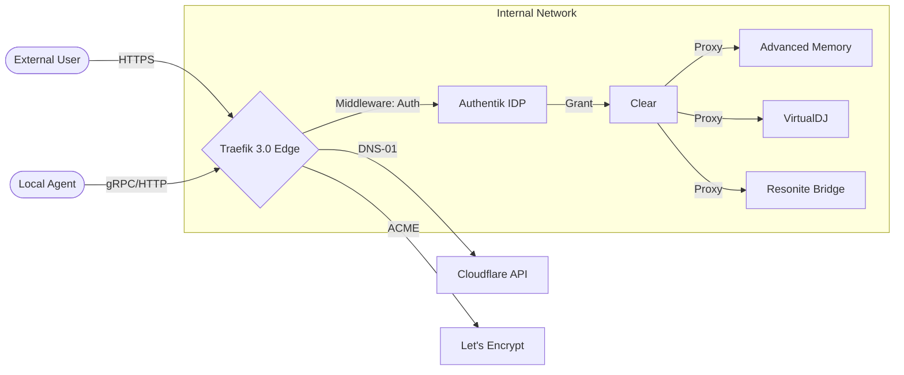

# Traefik v3.0: Edge Router & Fleet Proxy Orchestration

Traefik is the primary cloud-native edge router for the fleet. It provides automated service discovery, SSL termination, and high-performance load balancing for the **58-service** grid. Operating at the ingress layer of the **Sandra** ecosystem, Traefik ensures seamless internal and external connectivity while enforcing security policies and traffic shaping.

> [!TIP]
> **Why Traefik 3.0?**: The v3.0 release introduces native support for **Wasm** plugins, improved performance for **HTTP/3**, and a refined configuration syntax that simplifies complex middleware chains critical for the SOTA agentic fleet.

---

## 🚀 Deployment & Routing Infrastructure

### Static Configuration (`traefik.yml`)
The static configuration defines the entry points and certificate resolvers. In the fleet, we prioritize **Entrypoint-level redirection** to ensure all traffic is encrypted by default.

```yaml
entryPoints:
  web:
    address: ":80"
    http:
      redirections:
        entryPoint:
          to: websecure
          scheme: https

  websecure:
    address: ":443"
    http:
      tls:
        certResolver: letsencrypt
        domains:
          - main: "sandra-fleet.vienna"
            sans:
              - "*.sandra-fleet.vienna"

certificatesResolvers:
  letsencrypt:
    acme:
      email: "admin@sandra-fleet.vienna"
      storage: "/etc/traefik/acme/acme.json"
      dnsChallenge:
        provider: cloudflare
        resolvers:
          - "1.1.1.1:53"
          - "8.8.8.8:53"
```

---

## 🌐 Dynamic Discovery: Docker Label Patterns

The flagship feature of Traefik is its automated discovery via Docker labels. Instead of manual proxy configuration, services "announce" themselves to the router.

### Standard Service Label Template
To expose a new SOTA-compliant webapp (e.g., `advanced-memory-mcp`), use the following labels in your `docker-compose.yml`:

```yaml
services:
  advanced-memory:
    labels:
      - "traefik.enable=true"
      - "traefik.http.routers.mem.rule=Host(`memory.sandra-fleet.vienna`)"
      - "traefik.http.routers.mem.entrypoints=websecure"
      - "traefik.http.routers.mem.tls=true"
      - "traefik.http.routers.mem.tls.certresolver=letsencrypt"
      - "traefik.http.routers.mem.middlewares=auth-chain@file,sec-headers@file"
```

---

## 🛡️ Middleware & Security Chains

Middleware in Traefik 3.0 allows for request manipulation before it reaches the backend. The fleet uses a standardized "Auth Chain" to protect internal assets.

### 1. ForwardAuth (Authentik Integration)
This middleware intercepts requests and verifies identity via the **Authentik Proxy Outpost**.
```yaml
# dynamic_conf.yml
http:
  middlewares:
    auth-chain:
      forwardAuth:
        address: "http://authentik-outpost:9000/outpost.goauthentik.io/auth/traefik"
        trustForwardHeader: true
        authResponseHeaders:
          - "X-authentik-username"
          - "X-authentik-groups"
          - "X-authentik-email"
```

### 2. High-Audit Security Headers
Enforces HSTS, prevents clickjacking, and sets strict referer policies.
```yaml
    sec-headers:
      headers:
        forceSTSHeader: true
        stsSeconds: 31536000
        stsIncludeSubdomains: true
        stsPreload: true
        browserXssFilter: true
        contentTypeNosniff: true
        frameDeny: true
        referrerPolicy: "same-origin"
```

---

## 🛠️ Advanced SOTA Workflows

### ⚡ The "Agent-Provisioned Subdomain"
AI agents can autonomously deploy ephemeral testing environments:
1. **Creation**: Agent generates a new `start.ps1` for a project fork.
2. **Naming**: Agent assigns a unique label: `Host("dev-v1.mem.sandra-fleet.vienna")`.
3. **Propagation**: Traefik detects the new container in < 500ms.
4. **Acquisition**: Traefik triggers the DNS-01 challenge with Cloudflare.
5. **Access**: The agent provides the user with an immediately accessible HTTPS URL.

### ⚡ Blue-Green Deployment with Weighted Load Balancing
Traefik allows for seamless traffic shifting between production and staging versions of the fleet:
- **Production (v1.4)**: Weight 90
- **Staging (v1.5-RAG)**: Weight 10
- **Logic**: Use the `traffic-split` service to gradually roll out the RAG-enabled memory engine.

---

## 📊 Observability & Health Monitoring

Traefik 3.0 provides a rich dashboard and metrics integration (Prometheus/Grafana).

### Healthcheck Configuration
Services must define healthchecks to prevent Traefik from routing traffic to "zombie" containers.
```yaml
    healthcheck:
      test: ["CMD", "curl", "-f", "http://localhost:10700/api/v1/health"]
      interval: 10s
      timeout: 5s
      retries: 3
```

### Dashboard Access
The Traefik dashboard is exposed securely at `proxy.sandra-fleet.vienna` using the same **Authentik** auth-chain to ensure only the primary administrator has visibility into the routing mesh.

---
## 🧜 Fleet Connectivity Mesh



---
*Maintained by: Antigravity AI (SOTA v13.0 Compliance)*
*Last updated: 2026-02-27*
*Fleet Status: Active & Secure*
