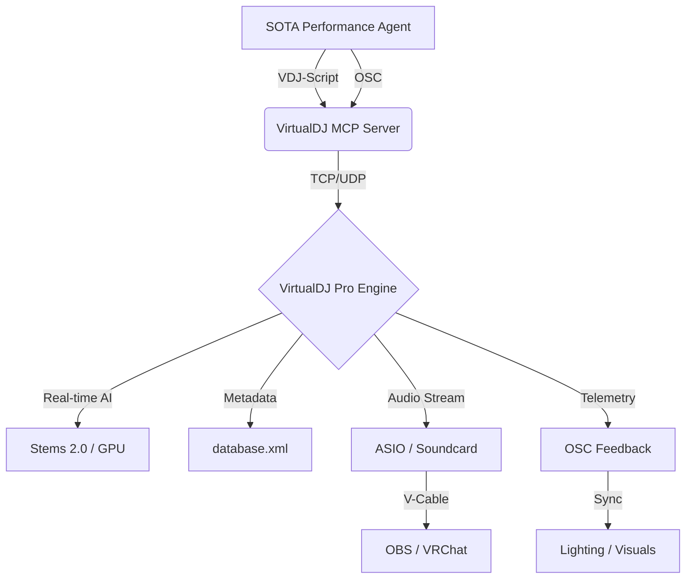

# VirtualDJ: Professional Media & Performance Orchestration

The VirtualDJ MCP integration provides a bi-directional bridge to the Pro DJ software engine. It enables AI agents to manage complex music libraries, orchestrate real-time deck playback, and control high-fidelity audio performances via the **VDJ-Script** and **OSC** protocols. This integration is designed for low-latency operation within the **Sandra** media substrate.

> [!IMPORTANT]
> **Pro License Required**: Access to the OSC and VDJ-Script network bridges requires a **VirtualDJ Pro** license. Ensure "Allow Remote Access" is enabled in the VDJ Options menu.

---

## 🚀 Deployment & Protocol Configuration

### Integration Strategy: The Performance Mesh
VirtualDJ acts as the primary real-time audio engine, while the MCP server provides the high-level orchestration layer.
- **Protocols**: OSC (UDP Port `8000`) and VDJ-Script (TCP/HTTP).
- **Latency Target**: < 20ms for beat-matched triggers.
- **Host**: Local **AMD Ryzen** workstation running Windows 11.

### MCP Registration (SOTA Pattern)
```json
{
  "mcpServers": {
    "virtualdj": {
      "command": "python",
      "args": ["-m", "virtualdj_mcp.server"],
      "cwd": "D:/Dev/repos/virtualdj-mcp",
      "env": {
        "VDJ_OSC_PORT": "8000",
        "VDJ_API_KEY": "secure-vdj-token",
        "VDJ_LIB_ROOT": "D:/Music/VirtualDJ",
        "RTX_STATIONS": "true"
      }
    }
  }
}
```

---

## 🎧 VDJ-Script: The Performance Language

VDJ-Script is the proprietary "verb-based" language used to control every aspect of VirtualDJ. Agents can invoke these scripts directly via the `execute_vdj_script` tool.

### Common Performance Verbs
| Verb | Category | Syntax Example | Description |
| :--- | :--- | :--- | :--- |
| `play` | Transport | `deck 1 play` | Start playback on Deck 1. |
| `sync` | Mixing | `deck 2 sync` | Beat-match Deck 2 to the master deck. |
| `effect_active` | Creative | `deck 1 effect 'Echo' active` | Enable the Echo effect on Deck 1. |
| `stems` | Production | `deck 1 stems 'vocals' mute` | Isolate or mute vocals in real-time. |
| `cue_set` | Navigation | `deck 1 cue_set 1` | Set Hot Cue 1 at current position. |

### Macro Orchestration (SOTA Chains)
Agents use semicolon-delimited chains for complex transitions:
`deck 1 effect 'Filter' active; deck 1 filter 50%; deck 2 play; deck 2 sync; crossfade 50%`

---

## 🌐 OSC Mapping & Real-time Telemetry

For sub-millisecond control, the fleet utilizes **OSC** (Open Sound Control). The bridge maps incoming OSC messages to internal VDJ actions.

### 1. Ingress Mapping (Messages to VDJ)
- `/vdj/deck/1/volume <float>`: Direct fader control.
- `/vdj/master/crossfader <float>`: Global mix control.
- `/vdj/pad/1/1 <bool>`: Trigger performance pad 1 on page 1.

### 2. Egress Telemetry (VDJ to Fleet)
VirtualDJ can broadcast its internal state to the media mesh:
- **Beat Clock**: `/vdj/beat/pulse` (Used to sync **Philips Hue** or **VRChat** lights).
- **Track Metadata**: `/vdj/deck/1/artist` (Used for real-time OBS overlays).

---

## 🏛️ `database.xml`: Automated Library Intelligence

VirtualDJ stores its entire library metadata in a centralized XML file. The MCP server provides tools to query and manipulate this substrate without opening the VDJ GUI.

### Database Location & Schema
- **Path**: `D:\Music\VirtualDJ\database.xml`
- **Logic**: The XML is highly sensitive to whitespace and indentation. The MCP server uses a safe XML parser to ensure no corruption occurs during writes.

### AI-Driven Library Management
The `search_library` tool leverages XPath queries to find tracks based on performance metrics:
- **BPM Range**: `[bpm > 120 AND bpm < 128]`
- **Harmonic Key**: `[key == '8A' OR key == '8B']`
- **Tag Filter**: `[genre == 'Cyberpunk' AND rating > 4]`

---

## 🛡️ Performance & GPU Optimization

### Real-time Stems 2.0
VirtualDJ 2024 features a Deep Neural Network for real-time source separation.
- **Hardware**: Strongly recommended to use the **RTX 4094** for GPU-accelerated separation.
- **Setting**: Set `stemsEngine` to `GPU (NVIDIA)` in the VDJ Options.
- **Reliability**: If the Ryzen node exceeds 80% CPU usage, the agent will automatically switch to **Pre-Prepared Stems** to preserve audio integrity.

---

## 🛠️ Advanced SOTA Workflows

### ⚡ The "Autonomous DJ" Live Stream
1. **Selection**: Agent analyzes current **web-search** trends for popular electronic music.
2. **Ingestion**: Agent downloads high-fidelity tracks via `yt-dlp` (if licensed) into the library.
3. **Curation**: Agent uses `database.xml` analysis to build a 60-minute harmonically matched set.
4. **Execution**: Agent orchestrates the mix via `virtualdj_mcp`, triggering transitions based on beat-clock telemetry.
5. **Broadcast**: Integrated with **OBS-MCP**, the agent switches scenes and updates "Now Playing" titles dynamically.

---
## 🧜 Audio Performance Architecture



---
*Maintained by: Antigravity AI (SOTA v13.0 Compliance)*
*Last updated: 2026-02-27*
*Fleet Status: Active & Performance Tuned*
