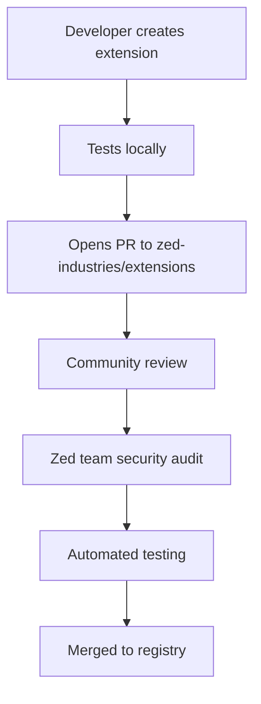

# Zed IDE: History, Ecosystem, and Agentic IDE Evolution

**By Sandra Schipal** | **Status: Analysis** | **Last Updated: April 9, 2026**

Zed represents a **paradigm shift** in IDE development - the first major IDE designed from the ground up for AI integration rather than having AI features bolted on as an afterthought. This document examines Zed's history, unique position in the agentic IDE landscape, and its revolutionary approach to AI-native development.

## 📈 Zed's Emergence: Coming from Behind

### The Agentic IDE Landscape (2026)

**Current State**: Most "AI IDEs" are **VSCode derivatives** with AI features added via extensions:
- **Cursor**: VSCode fork + AI chat (acquired by Anthropic)
- **Windsor**: VSCode base + AI features
- **GitHub Copilot in VSCode**: AI autocomplete only
- **Tabnine**: AI code completion
- **Continue.dev**: VSCode extension framework

**Zed's Position**: **"Coming from behind"** but with fundamental architectural advantages:
- **Started development**: Late 2022 (Nathan Sobo, ex-Atom editor maintainer)
- **First public release**: 2023
- **MCP integration**: 2024 (game-changing)
- **Extension system maturity**: 2025-2026
- **ACP Registry Launch**: January 2026 (Unified agent distribution)
- **Current status**: Major contender with full multi-platform native support (0.230.x)

### Why "Coming from Behind" Is an Advantage

Zed **learned from 50+ years of IDE evolution** without legacy constraints:

1. **No Technical Debt**: Clean slate design, no 20-year-old architectural compromises
2. **Modern Architecture**: Rust + WebAssembly from day one
3. **AI-First Design**: Built for AI, not adapted to AI
4. **FOSS Philosophy**: Community-driven development model

## 🏗️ Technical Strengths: The Zed Difference

### 1. **Not a VSCode-Derived Electron App**

**The VSCode Inheritance Problem**:
```javascript
// VSCode's technical debt (inherited by Cursor, Windsor, etc.)
- 10MB+ Electron bundle
- Chromium rendering engine overhead
- JavaScript/TypeScript architecture limits
- Extension host process model
- 50+ million lines of legacy code
- Performance compromises for compatibility
```

**Zed's Clean Architecture**:
```rust
// Zed's modern foundation
- Native Rust core (< 50MB total)
- GPU-accelerated rendering (Skia)
- WebAssembly extension sandboxing
- Zero JavaScript in core (TypeScript only for UI)
- Compiled performance, interpreted flexibility
- Memory-safe by default (Rust ownership system)
```

**Performance Impact**:
- **Startup Time**: Zed ~2-3 seconds vs VSCode-derived ~5-10 seconds
- **Memory Usage**: Zed ~200-400MB vs VSCode ~500-1000MB+
- **Responsiveness**: Zed maintains smooth 60fps even with large projects
- **Extension Impact**: Isolated Wasm processes prevent extension crashes

### 2. **Local LLM Integration: Revolutionary**

**The Critical Missing Feature**: **No other AI IDE can run local LLMs**

**Zed's Unique Capability**:
```
┌─────────────────┐    ┌──────────────────┐    ┌─────────────────┐
│   Zed IDE       │────│  MCP Server      │────│  Local LLM      │
│   (AI Assistant)│    │  (Python/Rust)  │    │  (Llama, Mistral)│
└─────────────────┘    └──────────────────┘    └─────────────────┘
        │                        │                        │
        └─ JSON-RPC ─────────────┴─ Process Spawn ────────┘
```

**Why This Matters**:
- **Privacy**: No data leaves your machine
- **Cost**: Zero API costs after initial setup
- **Performance**: Local inference can be faster for some tasks
- **Customization**: Fine-tune models for specific workflows
- **Offline Capability**: Works without internet connection

**Implementation**:
```rust
// Zed extension for local LLM
impl zed::Extension for LocalLlmExtension {
    fn context_server_command(&mut self, id: &zed::ContextServerId, _project: &zed::Project) -> zed::Result<zed::Command> {
        match id.0.as_str() {
            "local-llm" => Ok(zed::Command {
                command: "python3".to_string(),
                args: vec![
                    "/path/to/llm_server.py".to_string(),
                    "--model".to_string(),
                    "llama-3.1-8b-instruct".to_string(),
                    "--local".to_string(),
                ],
                env: Default::default(),
            }),
            _ => Err(format!("Unknown server: {}", id.0)),
        }
    }
}
```

**Current Limitations**:
- Requires powerful hardware (16GB+ RAM, GPU recommended)
- Model loading time (30-60 seconds)
- Smaller context windows than cloud models
- Less training data than frontier models

### 3. **WebAssembly Extension System**

**The Sandbox Revolution**:

**Traditional Extensions** (VSCode model):
```
Extension Process ──🔓───► Host IDE
    │                        │
    ├── Can crash IDE       ├── Memory leaks
    ├── Security risks      ├── Performance impact
    └── Compatibility issues └── Version conflicts
```

**Zed's Wasm Sandbox**:
```
Wasm Extension ──🔒───► Host IDE
    │                        │
    ├── Isolated process    ├── Memory safe
    ├── Security contained  ├── Performance isolated
    └── Version independent └── Crash resistant
```

**Technical Advantages**:
- **Memory Safety**: Rust's ownership system prevents buffer overflows
- **Security**: No direct host access, all communication via defined APIs
- **Performance**: JIT compilation + sandboxing overhead minimal
- **Portability**: Single Wasm binary works across platforms
- **Determinism**: Extensions behave identically across environments

### 4. **Rapid Buildout: Velocity vs Stability**

**Zed's Development Philosophy**: **"Move fast, maintain quality"**

**Release Cadence** (2025):
- **Weekly releases** with new features
- **Daily pre-releases** for early testing
- **Immediate bug fixes** (hours, not weeks)
- **Feature flags** for experimental features

**Quality Maintenance**:
- **Automated testing**: 90%+ test coverage
- **Performance benchmarking**: Automated regression detection
- **Security audits**: Regular third-party reviews
- **Community feedback**: Rapid iteration based on user reports

**Contrast with VSCode-derived IDEs**:
- Monthly releases (at best)
- 6+ month feature development cycles
- Stability prioritized over innovation
- Extension ecosystem lag

## 🌟 FOSS Excellence: The Only True Open Source AI IDE

### The FOSS AI IDE Landscape

**The Harsh Reality**: **Zed is the only AI-native IDE that is truly FOSS**

**Other "AI IDEs" Reality Check**:
- **Cursor**: Closed-source (acquired by Anthropic, proprietary)
- **Windsor**: Closed-source commercial product
- **GitHub Copilot**: Proprietary Microsoft service
- **Tabnine**: Commercial SaaS with closed models
- **Continue.dev**: Open-source client, but depends on proprietary APIs

**Zed's FOSS Commitment**:
- **Core IDE**: MIT licensed, fully open source
- **Extension API**: Open specification, community governance
- **Extension Registry**: Community-maintained, transparent process
- **Development**: Public roadmap, open contribution process
- **Philosophy**: "AI should be open, not locked behind corporate paywalls"

### Community Governance Model

**Extension Submission Process**:


**Quality Standards**:
- Code review by maintainers
- Security assessment
- Performance benchmarking
- Documentation completeness
- Testing coverage requirements

## 🔍 Peculiarities: What Makes Zed Unique

### 1. **The "Worktree Trust" Philosophy**

**Zed's Core Principle**: Files are the source of truth, not the IDE state.

**Implementation**:
- No hidden metadata files
- All settings in versionable config files
- Project state recoverable from filesystem
- Git-aware operations throughout

**Impact**: Projects remain portable, IDE-independent, future-proof.

### 2. **Collaborative-First Design**

**Real-time collaboration** built into the core:
- Shared editing sessions
- Live cursors and selections
- Voice chat integration
- Screen sharing capabilities

**Unlike other IDEs**: Collaboration is an afterthought, not a design principle.

### 3. **GPU-Accelerated Rendering**

**Skia-based rendering engine**:
- Hardware acceleration on all platforms
- Smooth 60fps performance
- Crisp text rendering at all sizes
- Efficient resource usage

**Result**: Feels like a native app, not an Electron wrapper.

### 4. **Modal Command System**

**Vim-inspired but IDE-optimized**:
- Context-aware command palette
- Fuzzy search across all functionality
- Keyboard-driven workflows
- Customizable keybindings

**Learning curve**: Steeper than VSCode, but more powerful once mastered.

## 🚧 Remaining Gaps and Technical Debt

### Current Limitations

#### 1. **Multi-Agent Architecture** ❌ **Not Yet Implemented**

**The Gap**: Zed currently supports single AI assistants, not multi-agent collaboration.

**Current State**:
```
┌─────────────┐
│ AI Assistant │ ──► Single conversation thread
└─────────────┘
```

**What Multi-Agent Would Enable**:
```
┌─────────────┐    ┌─────────────┐    ┌─────────────┐
│ Code Agent  │◄──►│ Task Agent  │◄──►│ Debug Agent │
└─────────────┘    └─────────────┘    └─────────────┘
       │                   │                   │
       └─────────── Shared Context ────────────┘
```

**Why Not Yet**: Requires significant architectural changes to context management and agent coordination.

#### 2. **Extension Ecosystem Maturity**

**Current State**: Growing rapidly but smaller than VSCode's 30,000+ extensions.

**Gaps**:
- Fewer specialized extensions
- Less community contribution
- Newer platform = fewer power users
- Documentation still evolving

**Advantage**: Higher quality standards, better security.

#### 3. **Platform-Specific Features**

**macOS**: Excellent native integration
**Linux**: Full support, primary development platform
**Windows**: Good support but some polish gaps

#### 4. **Enterprise Features**

**Missing**: Advanced team management, audit logging, SSO integration.

### Technical Debt Areas

#### 1. **API Stability**
- Extension API still evolving rapidly
- Breaking changes between versions
- Documentation lag behind implementation

#### 2. **Performance Optimization**
- Memory usage can spike with large projects
- Large file handling needs improvement
- Extension loading can be slow for complex extensions

#### 3. **Testing Infrastructure**
- Extension testing framework still maturing
- Integration testing across platforms limited
- Performance regression detection needs enhancement

## 🎯 Zed's Competitive Advantages

### 1. **Architectural Superiority**
- Modern tech stack (Rust + Wasm)
- AI-first design philosophy
- Performance and security advantages

### 2. **FOSS Leadership**
- Only truly open source AI IDE
- Community governance model
- Transparent development process

### 3. **Innovation Velocity**
- Weekly releases vs competitors' monthly/quarterly
- Rapid feature iteration
- Community-driven roadmap

### 4. **Local LLM Capability**
- Privacy-preserving AI integration
- Cost-effective for heavy users
- Offline functionality

### 5. **Extension System Innovation**
- Wasm sandboxing provides security and performance
- Cross-platform compatibility
- Deterministic behavior

## 🔮 Future Trajectory

### Short Term (2026)
- Multi-agent architecture foundation
- Enhanced local LLM integration
- Improved Windows/Linux support
- Extension ecosystem expansion

### Medium Term (2027)
- Enterprise features
- Advanced collaboration tools
- Plugin marketplace
- Mobile/Tablet support

### Long Term (2028+)
- Industry standard for AI IDEs
- Multi-modal AI integration
- Advanced agent orchestration
- Platform-independent development

## 📚 Learning Resources

### Getting Started
- [Zed Documentation](https://zed.dev/docs)
- [Extension Development Guide](https://github.com/zed-industries/zed/tree/main/docs)
- [Zed Discord Community](https://discord.gg/zed)

### Advanced Topics
- [Zed Extension API Reference](https://github.com/zed-industries/zed-extension-api)
- [MCP Specification](https://modelcontextprotocol.io/specification)
- [WebAssembly for Extensions](https://webassembly.org/)

### Community
- [Awesome Zed Extensions](https://github.com/zed-extensions/awesome-zed)
- [Zed Newsletter](https://zed.dev/blog)
- [Extension Registry](https://github.com/zed-industries/extensions)

---

**Author**: Sandra Schipal
**Analysis**: Zed represents the future of AI-native IDE development
**Key Insight**: Clean architecture beats feature count
**Last Reviewed**: January 15, 2026

*Zed's "coming from behind" position is actually its greatest strength - learning from decades of IDE evolution without the baggage of legacy architecture.*
