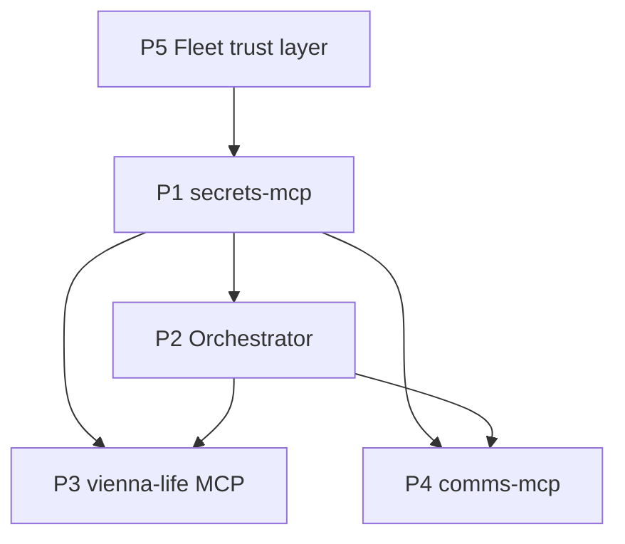

# Fleet gap-closure roadmap

**Date:** 2026-06-05  
**Scope:** ~195 top-level dirs, ~120 MCP servers, ~167 meaningful repos  
**Trigger:** Fleet breadth audit — hi-end domain MCPs without glue, trust, or daily-life APIs

---

## Executive summary

The fleet is a **personal AI operating system** with exceptional horizontal coverage (media, robotics, CAD, VR, research, Windows ops). The glaring omissions are not another niche tool — they are:

1. **Trust** — secrets sprawl, catalog drift, dead servers in index, no contract tests  
2. **Glue** — no durable cross-MCP workflow layer; `ednaficator` inactive  
3. **Daily life as MCP** — `vienna-life-assistant` exists as app, not agent infrastructure  
4. **Comms** — email/Discord/video strong; WhatsApp/Signal/Telegram absent  
5. **Unified knowledge retrieval** — six silos, no ranked cross-corpus answer layer (Phase 2)

This roadmap sequences **five priority items** that unblock everything else.

---

## Fleet strategy (operating principles)

### What we optimized for (2015–2026)

| Pattern | Evidence |
|---------|----------|
| **One MCP per ecosystem** | Plex, Blender, Ring, Calibre, Reaper, … |
| **FastMCP 3.2 SOTA** | Portmanteau tools, web_sota pairs, MCPB, sampling |
| **Windows-first personal ops** | PyWinAuto, WinOps, NTFS fastsearch, PowerShell launchers |
| **Vienna / Austria context** | Transit, legal hints (torrent), data residency (ednaficator vision) |
| **Creative → game → VR pipeline** | Marble → Godot → itch; Blender → Unity → Resonite |

### What we under-invested in

| Gap | Risk |
|-----|------|
| **Catalog truth** | ~58 repos on disk not in `fleet-registry.json` (119 registered) |
| **Integration testing** | `mcp-test-suite` inactive — agents trust broken tools |
| **Credential hygiene** | Passwords in `config.yaml` and docs; no vault MCP |
| **Orchestration** | RoboFang + MetaMCP + Fritz + federation — no single workflow DAG |
| **Life admin API** | Calendar/todos/expenses in VLA app only |
| **MemOps utilization** | advanced-memory wired in RoboFang but notes not written after sessions |

### Strategic shift (2026 H2)

```text
FROM:  "Add another MCP when we discover a tool"
TO:    "Make the zoo operable — trust, glue, life APIs, then depth"
```

**Depth over breadth rule:** No new domain MCP until P1 (secrets) and P5 (trust layer) are at least Phase 1 complete.

---

## Priority stack

| P | Item | Repo target | Ports (proposed) | Phase 1 exit |
|---|------|-------------|------------------|--------------|
| **P1** | secrets-mcp | `secrets-mcp` (new) | 11024 / 11025 | Read-only Bitwarden CLI inject; fleet `.env` audit |
| **P2** | Orchestrator decision | `ednaficator` revive **or** `fleet-workflow-mcp` (new) | 10942/10943 or 11026/11027 | One documented path for multi-step fleet flows |
| **P3** | vienna-life MCP surface | `vienna-life-assistant` (extend) | existing + `/mcp` | 6 life tools callable from Cursor |
| **P4** | comms-mcp | `comms-mcp` (new) | 11028 / 11029 | One channel E2E (Telegram bot first) |
| **P5** | Fleet trust layer | `mcp-test-suite` revive + MCD ops | n/a | Registry sync script + 20 server smoke contracts |

Phase 2 (after P1–P5): meta-knowledge retrieval MCP, health/wellness, Spotify taste layer, Austrian e-gov — see [Deferred backlog](#deferred-backlog-phase-2).

---

## Dependency graph



P5 can start immediately (no secrets). P1 blocks anything that needs API keys at runtime. P2 blocks reliable multi-step life/comms flows.

---

## Phased timeline (suggested)

### Wave 0 — Trust baseline (2 weeks)

- [x] `sync-fleet-registry.ps1` — disk scan → diff report (`scripts/output/`)
- [x] `merge-fleet-registry.py` — merged 24 entries → **143** fleet registry total
- [x] `sdr-mcp` quarantined in registry
- [x] `mcp-test-suite` revived (golden 22, pytest passing)
- [ ] Sync `FLEET_INDEX.md` from pending markdown (manual review)
- [ ] MemOps ingest when MCP back online

### Wave 1 — P1 secrets-mcp (3 weeks)

- [x] Scaffold `secrets-mcp` v0.1.0 (`secrets_ops`, audit, Bitwarden stub) — ports **11026/11027**
- [ ] web_sota audit dashboard
- [ ] Fritz daily `audit_fleet` heartbeat

See [specs/P1-secrets-mcp.md](specs/P1-secrets-mcp.md).

### Wave 2 — P2 orchestrator (4 weeks)

- [x] `workflows/morning_brief.yaml` (WF-001) + fleet_bridge: glance, vienna-life, secrets
- [ ] Wire heartbeat → `workflow_start('morning_brief')` on schedule
- [ ] ednaficator revival (decision gate 2026-06-20)

See [specs/P2-orchestrator-decision.md](specs/P2-orchestrator-decision.md).

### Wave 3 — P3 + P4 parallel (4 weeks)

- [x] `vienna_life` MCP portmanteau mounted at `http://127.0.0.1:10922/mcp`
- [x] VLA meta dashboard `/fleet` (L3)
- [ ] Wire life tools to main backend SQLAlchemy (replace mocks)
- [ ] `comms-mcp` Telegram v0.1

### Wave 4 — Phase 2 backlog grooming

Prioritize from deferred list based on daily friction logs (Fritz heartbeat can collect).

---

## Runts policy

Servers in catalog with `Inactive` or P1 bugs create **false completeness**. Policy:

| Action | Criteria |
|--------|----------|
| **Fix or quarantine** | Listed in FLEET_INDEX but fails health smoke |
| **Quarantine** | Move to `_archives/` or `status: archived` in registry; remove from Cursor default MCP config |
| **Merge** | Duplicate capability (e.g. `vbox-mcp` ⊂ `virtualization-mcp`) |

Current quarantine candidates: `sdr-mcp`, `vbox-mcp`, `mcp-links-service`, `ednaficator` (until P2 decision).

---

## Deferred backlog (Phase 2)

| Domain | Proposal | Why deferred |
|--------|----------|--------------|
| Meta-knowledge | `knowledge-hub-mcp` — federated search over memops + obsidian + notion + calibre + arxiv | Needs P5 corpus freshness + P1 for API keys |
| Health | `health-mcp` — Apple Health export / Garmin Connect | No existing repo; privacy review |
| Music taste | `spotify-mcp` or extend `plex-mcp` | Hermes pattern in `external/`; lower than comms |
| Austrian e-gov | `at-egov-mcp` — FinanzOnline read-only status | Legal/compliance review |
| Cloud IaC | `iac-mcp` — Terraform plan/apply read-only | Home lab; after secrets |
| Mobile bridge | `ios-bridge-mcp` — Shortcuts webhook inbox | Apple stack thin today |

---

## Success metrics (2026-09-01)

| Metric | Target |
|--------|--------|
| Registry coverage | ≥95% of active `*-mcp` repos in `fleet-registry.json` |
| Smoke pass rate | ≥90% of registered servers pass daily contract test |
| Secrets in git | 0 plaintext passwords in tracked config/docs |
| Agent workflow | 3 documented E2E flows (morning brief, media request, comms reply) |
| MemOps notes | ≥1 fleet strategy note per month ingested to advanced-memory |

---

## References

- [FLEET_CONTROL_PLANE.md](../FLEET_CONTROL_PLANE.md)
- [projects/FLEET_INDEX.md](../../projects/FLEET_INDEX.md)
- [research/notes/FLEET_STRATEGY_MEMOPS.md](../../research/notes/FLEET_STRATEGY_MEMOPS.md)
- Specs: [specs/](specs/)
