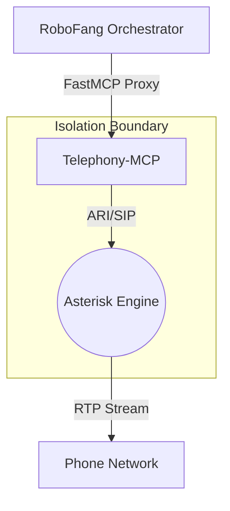

# Pattern: Modular MCP Repository

**Domain-Specific Isolation for Heavy Actuators** (SOTA 2026)

---

## 🎯 Purpose
As MCP orchestrators like **RoboFang** evolve, they tend to collect heavy, brittle, or security-sensitive dependencies (e.g., Asterisk/SIP stacks, large SDKs, specialized HW drivers).

The **Modular Repository Pattern** mandates that heavyweight "Actuators" should be split into sovereign MCP repositories rather than bundled into the orchestrator core.

### Why?
1. **Dependency Hygiene**: Prevents the "Orchestrator Bloat" failure mode where a simple robotics hub requires full telephony or database binaries just to start.
2. **Security Isolation (DefenseClaw)**: A modular telephony-mcp can be granted OS-level permissions (VOIP ports, microphone access) that the rest of the fleet does not need.
3. **Reusability**: `telephony_mcp` can be used by other fleet agents (OpenClaw, OpenManus) without duplicating the "Clean Bridge" logic.

---

## 📐 Architecture



## 🛠️ Implementation Guidance

1. **Standalone FastMCP Server**: The new repository must be a compliant **FastMCP 3.1+** server.
2. **Standardized Tool naming**: Prefix tools to avoid orchestrator namespace collisions (e.g., `telephony_make_call` instead of just `make_call`).
3. **Mounting**: Use the **Server Composition Pattern** to mount the modular server into the hub:
   ```python
   # Inside robofang/server.py
   mcp.mount("telephony_mcp", as_proxy=True)
   ```

## 🚨 Anti-patterns
- **Double-Abstraction**: Don't wrap the same tool twice. Use `as_proxy=True` to let the modular server shine through directly to the LLM.
- **Dependency Leaks**: If `telephony_mcp` and `robofang` share a library, move that library to a `shared-core` package or use independent versioning.

---
**Status**: Adopted (2026-04-19) for **RoboFang (Beta)** telephony integration.
