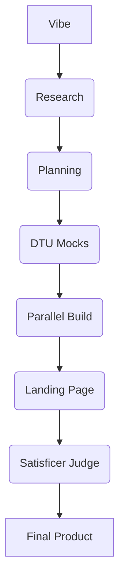

# Dark App Factory Architecture

**Version**: 1.5
**Protocol**: Async-Parallel Orchestration

## 1. High-Level Logic
Dark App Factory (DAF) treats software development as an industrial assembly line. It operates on a **Single Source of Truth** (`specs.md`) generated by a high-intelligence **Foreman**.

### The Assembly Line
1. **Intelligence (Foreman)**: Defines the blueprint and success criteria (scenarios).
2. **Labor (Worker Council)**: Implements the blueprint in parallel tiers.
3. **Verification (Satisficer)**: Audits the final product against the blueprint.

## 2. The Orchestrator (`factory.py`)
The factory pipeline is a strictly sequenced flow of 7 industrial steps:

## 3. Parallel Tiers (Worker Council)
DAF optimizes build time using dependency-aware tiers. Specialists in Tier 1 run simultaneously, only after Tier 0 (The Professor) has established the domain skill battery.

- **Tier 0**: `Professor` (Knowledge Seeding)
- **Tier 1**: `Plumber` (Backend), `Sculptor` (Frontend), `Registrar` (Infra), `Nervos` (Messaging), etc.
- **Tier 2**: `Librarian` (Docs), `Shakespeare` (Copy), `Morpheus` (Security), `Amodei` (AI Integration), etc.
- **Tier 3**: `Propagandist` (Distribution Assets)
- **Tier 4**: `Generalist` (Final Polish)

## 4. Deep-Crawl Recursive Implementation
A unique feature of DAF is the **Deep-Crawl** mechanism. After the council completes its work, the orchestrator scans all generated files for "dangling imports" (references to components or modules that don't exist yet). It then recursively tasks the `Generalist` to implement these missing pieces until the import graph is closed.

## 5. Technical Safeguards
- **Anti-Gaslighting**: Prompts are hardened against skeleton code and placeholders.
- **Validation Hooks**: Every specialist implements a `validate()` function that checks for syntax, missing exports, or health endpoints.
- **Error Injection Retries**: If validation fails, the error message is injected back into the specialist's prompt for up to 3 self-correction attempts.
