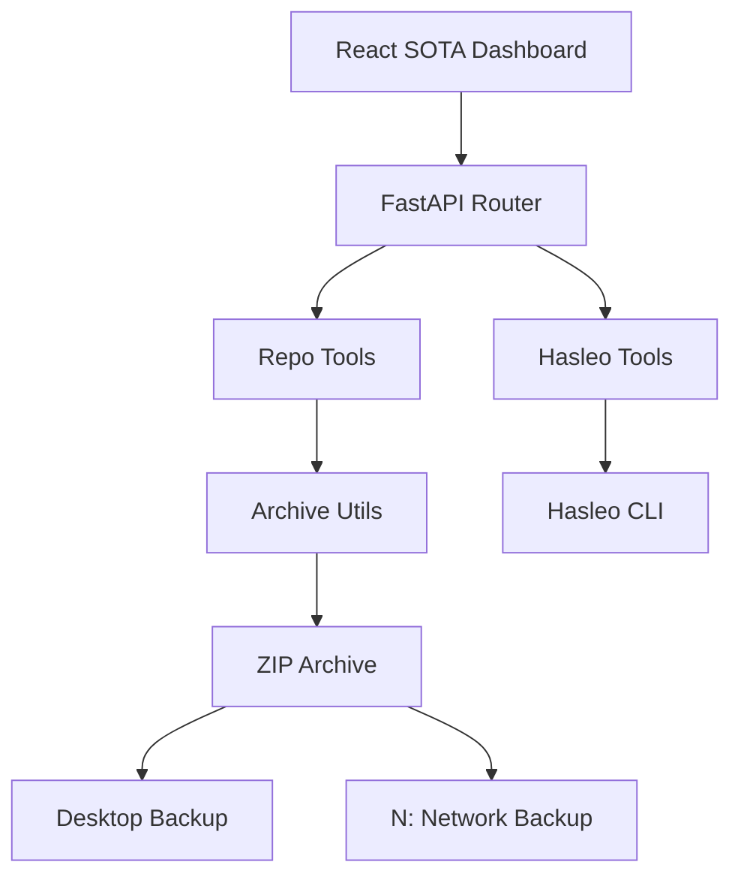

# Multi-Backup MCP -- Project Status

**Last Updated**: 2026-02-15
**Repo**: `D:\Dev\repos\multi-backup-mcp` | [GitHub](https://github.com/sandraschi/multi-backup-mcp)
**Version**: v0.3.0
**Python**: 3.10+ | **Build**: Setuptools
**Status**: 🟢 PRODUCTION READY

---

## What It Is

A professional-grade backup orchestration server built on FastMCP. It provides a unified interface for:
1. **Hasleo Backup Suite Integration**: CLI-driven system and partition backups.
2. **Native Repository Archival**: Intelligent ZIP creation with SOTA pruning (excludes `node_modules`, `.venv`, etc.).
3. **Nuclear Backups**: High-impact batch archival of all repositories in `D:/Dev/repos`.
4. **Multi-Destination Distribution**: Automated delivery to local (Desktop) and network (N: drive) targets.

---

## Architecture

---

## Current State (v0.3.0)

### What Works

| Feature | Status | Notes |
|---------|--------|-------|
| Hasleo Discovery | Working | Detects installation and lists jobs |
| Repository Scan | Working | Identifies `.git` and MCP signatures |
| SOTA Pruning | Working | Logic-driven exclusion of heavy libraries |
| Nuclear Backup | Working | Batch archival with progress tracking |
| Multi-Destination | Working | Parallel push to local/network paths |
| AI Chat Interface | Working | Glassmorphic UI connected to backup tools |
| Service Status | Working | Comprehensive health and job statistics |

---

## Port Allocation

| Service | Port | Status |
|---------|------|--------|
| Frontend | 10798 | Reserved |
| Backend | 10799 | Reserved |

---

## Immediate Next Actions

1. **Scheduled Backups**: Implement native scheduling within the MCP wrapper.
2. **Cloud Integration**: Add S3/B2 targets for off-site redundancy.
3. **Verification Loop**: Automated checksum verification after push.
