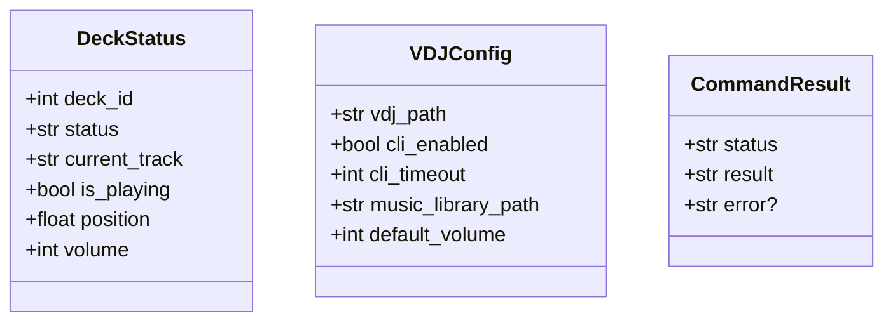

# VirtualDJ-MCP Product Requirements Document (PRD)

## 1. Product Overview

### 1.1 Product Name
**VirtualDJ-MCP** (Media Control Protocol for VirtualDJ)

### 1.2 Product Description
VirtualDJ-MCP is a professional DJ automation server that bridges Claude AI with VirtualDJ software, enabling AI-assisted DJing, automated mixing, and intelligent track selection. The system uses VirtualDJ's real CLI commands and VDJScript expressions (not a fake REST API) to provide seamless control through natural language commands and automated workflows.

### 1.3 Target Users
- Professional DJs looking to enhance their workflow
- Radio station operators needing automated playout
- Event DJs requiring intelligent track selection
- Music enthusiasts exploring AI-assisted mixing
- Developers building DJ automation solutions

## 2. Core Features

### 2.1 Core VirtualDJ Control
- **Deck Operations**: Load, play, pause, stop, and seek tracks on VirtualDJ decks
- **Volume & EQ**: Control volume levels and basic EQ on individual decks
- **Playback Status**: Monitor current track, position, BPM, and deck state
- **Track Loading**: Load tracks from file paths to specific decks

### 2.2 Mixing & Crossfader
- **Crossfader Control**: Move crossfader from -100% (deck 1) to +100% (deck 2)
- **Auto-Sync**: Enable automatic BPM synchronization between decks
- **Beatmatching**: Basic beatmatching assistance through VirtualDJ features
- **Mixer Monitoring**: Get crossfader position and master volume levels

### 2.3 VirtualDJ Automation
- **Auto-DJ**: Use VirtualDJ's built-in Auto-DJ with crossfader transitions
- **Recording Control**: Start/stop recording with format and filename options
- **Session Management**: Monitor recording status and performance metrics
- **Basic Effects**: Apply VirtualDJ's built-in effects to decks

### 2.4 Library & Information
- **Library Browsing**: Basic library navigation and track information
- **Track Search**: Simple track lookup by filename/path
- **Performance Monitoring**: Real-time deck status and system variables
- **Status Reporting**: Get current playback state and track information

## 3. Technical Specifications

### 3.1 System Architecture
- **Framework**: FastMCP 3.1.1++ (latest production framework)
- **Backend**: Python 3.10+ (Windows/PowerShell optimized)
- **Dual Interface**: MCP (Claude Desktop) + FastAPI (Web API)
- **Modular Design**: Organized tool categories with clean separation
- **Integration**: VirtualDJ CLI commands + VDJScript expressions (no fake REST API)

### 3.2 Interface Specifications

#### MCP Interface (Claude Desktop)
- **Protocol**: stdio-based communication
- **Tools**: 25+ VirtualDJ control tools
- **Categories**: Deck Control, Mixing, Library, Automation, Performance
- **Error Handling**: Comprehensive MCP error format
- **Documentation**: Self-documenting tool descriptions
- **VDJScript Support**: Advanced conditional operations and automation

#### FastAPI Web Interface
- **Endpoints**: 7 versioned API endpoints (/api/v1/)
- **Documentation**: OpenAPI 3.0 schema at /api/docs
- **Health Monitoring**: /health endpoint with system status
- **Purpose**: Alternative interface for web-based control and testing
- **CORS Support**: Configurable cross-origin access
- **Status Codes**: Proper HTTP status codes (200, 400, 404, 500)

### 3.4 Core Components
1. **VDJ Client**: Executes CLI commands and VDJScript expressions against VirtualDJ
2. **MCP Server**: FastMCP-based server handling Claude Desktop communication
3. **FastAPI App**: Web server providing alternative interface and testing endpoints
4. **Config Manager**: Pydantic-based configuration with environment variable support
5. **Tool Registry**: Modular FastMCP tool organization (deck_control, mixing, library, etc.)

### 3.5 Data Models

## 4. User Flows

### 4.1 Basic DJ Workflow
1. User loads tracks into VirtualDJ decks using CLI commands
2. User controls playback (play/pause/stop) through MCP tools
3. User adjusts volume levels and monitors deck status
4. User controls crossfader for manual mixing between decks
5. System provides real-time status updates and variable monitoring

### 4.2 VirtualDJ Auto-DJ Workflow
1. User enables VirtualDJ's built-in Auto-DJ features
2. System configures crossfader transitions and fade parameters
3. VirtualDJ automatically loads and mixes tracks from library
4. System monitors Auto-DJ status and provides feedback
5. User can start/stop recording of the Auto-DJ session

## 5. Web API Interface

### 5.1 System Endpoints
- `GET /health` - Health check with server status and timestamp
- `GET /api/docs` - Interactive OpenAPI documentation
- `GET /api/redoc` - Alternative API documentation
- `GET /api/openapi.json` - OpenAPI schema for integration

### 5.2 FastAPI Purpose
The FastAPI web interface provides:
- Alternative access method to MCP functionality
- Testing and development interface
- CORS-enabled for web applications
- OpenAPI documentation and schema generation

**Important**: This is a web interface for the MCP server itself, not a VirtualDJ REST API. All VirtualDJ control is handled through CLI commands and VDJScript expressions sent to the running VirtualDJ application.

## 6. Non-Functional Requirements

### 6.1 Performance
- CLI command response time < 500ms (includes VirtualDJ processing)
- Real-time status monitoring with 2-second updates
- Support for standard VirtualDJ operations and features

### 6.2 Security
- Local execution only (no network exposure)
- Input validation for file paths and commands
- Safe CLI command execution with timeout protection

### 6.3 Compatibility
- VirtualDJ 2023 or later
- Windows 10/11, macOS 12+
- Support for common audio formats (MP3, WAV, FLAC, AIFF)

## 7. Future Enhancements
1. **Enhanced VDJScript**: More complex automation scripts
2. **Library Integration**: Better music library scanning and organization
3. **Recording Features**: Advanced recording with metadata
4. **Performance Analytics**: Real-time mixing analytics and feedback
5. **Hardware Integration**: Enhanced controller mapping support

## 8. Success Metrics
- Reliable CLI command execution (>99% success rate)
- Real-time VirtualDJ status monitoring
- Successful Claude Desktop MCP integration
- Working examples and documentation

## 9. Dependencies
- VirtualDJ (free version sufficient for basic features)
- Python 3.10+
- Windows 10/11 (primary platform)
- psutil (process monitoring)
- fastmcp, fastapi, pydantic (core libraries)

## 10. Implementation Notes
- **No Database Required**: All operations are direct CLI commands to VirtualDJ
- **No External APIs**: Pure local VirtualDJ control through command line
- **Real-Time Status**: Variable monitoring through `get_var` commands
- **VDJScript Support**: Advanced conditional operations and automation

## 11. Appendix
- [MCP Production Checklist](./MCP_PRODUCTION_CHECKLIST.md)
- [VirtualDJ Reference](./VIRTUALDJ_REFERENCE.md)
- [Development Plan](./DEVELOPMENT_PLAN.md)
- [Help Content](./HELP_CONTENT.md)
- [Examples](../examples/README.md)

